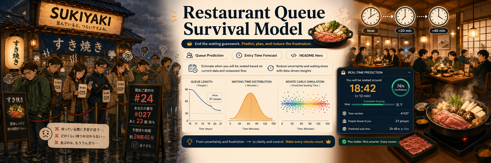

# 牛New寿喜烧自助餐排队等待时间生存模型

这是一个统计学应用研究项目，用于建模“牛New寿喜烧自助餐”的排队等待时间，并根据当前排队状态预测某位顾客的进场时间分布。



项目把每桌用餐时长看作带 120 分钟上限的 survival time，并用 Monte Carlo 方法模拟未来多桌释放过程。输出不是单一点估计，而是等待时间和进场时间的分布摘要。

## 统计模型概述

营业用餐时间为 16:00 到 22:00。记 16:00 为 `t=0`，单位为分钟，22:00 为 `t=360`。

自然用餐时间 \(X\) 可服从 Weibull 或 Lognormal 分布，实际占桌时间为：

\[
T = \min(X, 120).
\]

因此 \(T\) 在 120 分钟处有一个点质量，表示用满 2 小时的顾客。

如果当前时刻为 \(c\)，第 \(j\) 张桌子已经用餐 \(a_j\) 分钟，则其剩余时间 \(R_j(c)\) 使用条件剩余寿命分布：

\[
P(R_j > r \mid T > a_j) = \frac{S_T(a_j+r)}{S_T(a_j)}.
\]

对所有桌子模拟未来释放事件并排序为：

\[
D_{(1)}(c) \le D_{(2)}(c) \le \cdots
\]

若某顾客前方还有 \(k\) 桌，则等待时间为：

\[
W_k(c) = D_{(k+1)}(c).
\]

## 安装方法

```bash
cd niuniu
pip install -r requirements.txt
```

也可以用 editable install：

```bash
pip install -e .
```

## 快速运行示例

```bash
python examples/synthetic_demo.py
python examples/predict_single_customer.py
python examples/compare_arrival_times.py
pytest
```

启动交互式前端：

```bash
streamlit run app/streamlit_app.py
```

前端提供单人进场预测和不同时段取号对比，可以调节当前时间、前方桌数、餐桌数、分布参数和 Monte Carlo 次数。

`compare_arrival_times.py` 会把图保存到：

```text
figures/arrival_time_comparison.png
```

## 示例命令

```bash
python examples/synthetic_demo.py
```

示例设定：

- 餐桌数：40
- 用餐时间：`TruncatedWeibullDiningTime(shape=3, scale=95, max_time=120)`
- 当前时间：18:00，即 `current_time=120`
- 前方桌数：20

## 输出解释

预测结果包含：

- `mean_wait`：平均等待时间
- `median_wait`：等待时间中位数
- `q10_wait`：等待时间 10% 分位数
- `q90_wait`：等待时间 90% 分位数，可作为保守估计
- `p_wait_le_30`：30 分钟内进场概率
- `p_wait_le_60`：60 分钟内进场概率
- `p_wait_le_90`：90 分钟内进场概率
- `mean_entry_time`：平均进场时间，单位为从 16:00 开始的分钟数
- `median_entry_time`：中位进场时间
- `q10_entry_time` / `q90_entry_time`：进场时间分位数

当没有真实当前桌龄 `table_ages` 时，代码使用“持续满座的平稳续订过程”近似生成当前桌龄。这个近似适合餐厅 16:00 后基本满座、桌子一空就补下一桌的情形。

## 仓库结构

```text
niuniu/
  README.md
  requirements.txt
  pyproject.toml
  src/
    queue_model/
      __init__.py
      distributions.py
      survival.py
      simulation.py
      prediction.py
      plotting.py
      utils.py
  examples/
    synthetic_demo.py
    predict_single_customer.py
    compare_arrival_times.py
  notebooks/
    exploratory_simulation.ipynb
  tests/
    test_distributions.py
    test_simulation.py
    test_prediction.py
  docs/
    model_document.md
  app/
    streamlit_app.py
```

## 后续改进方向

- 用真实历史翻台数据估计 Weibull 或 Lognormal 参数。
- 引入非均匀取号到达率，刻画晚餐高峰。
- 建模不同人数、桌型、拼桌规则对等待时间的影响。
- 加入 no-show、过号、暂停放号等运营机制。
- 用后验预测分布表达参数不确定性。
